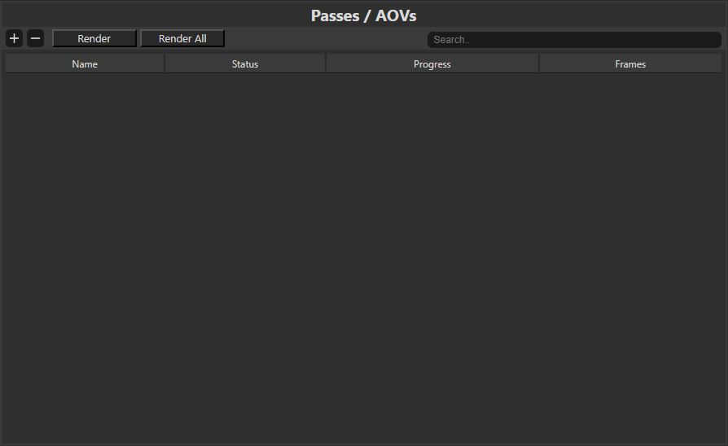

# Batch Rendering using Arnold Scene Source

The **Batch Rendering App** is used to render **.ass** files outside of Maya, and can tracked all renders progressions.

## Interface

The Application is divided into 5 sections, Save/Open, Plans, Passes/AOVs, Tasks and Slaves (WIP).

## Plans Section

You can click on the **+** button to add a new arnold file.
You can also click on the **-** button to remove the selected plan.

You can set an **output** folder on top of the section, this will be the folder where all renders will be written.

## Passes Section

If you have selected a plan you can click on the **+** button to add a passes and set it a name.

Once you've create a pass you can double click on it to edit the settings.
It'll show a new window where you can change the **frame range**, the **camera**, the **resolution**, the **samples** and the **depth**.
You even can change the **visibility** of all objects int the scene.

Then you can **select** the desired pass to render and click **render**, or you can click on the **render all** button.

## Tasks Section

Once you've clicked on the **render** button. It will add a new render in the tasks section. You will see the render progression for each pass.
You can also stop a render by clicking on the **-** button.

